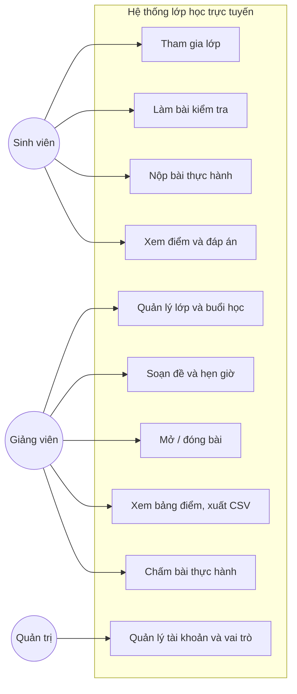
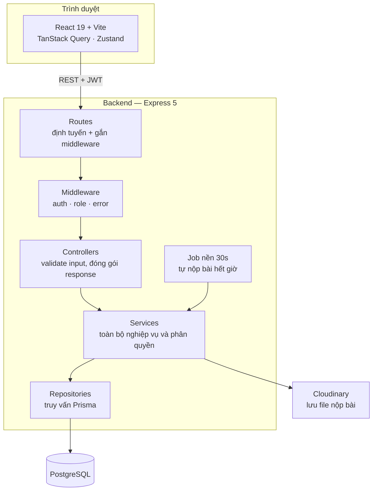
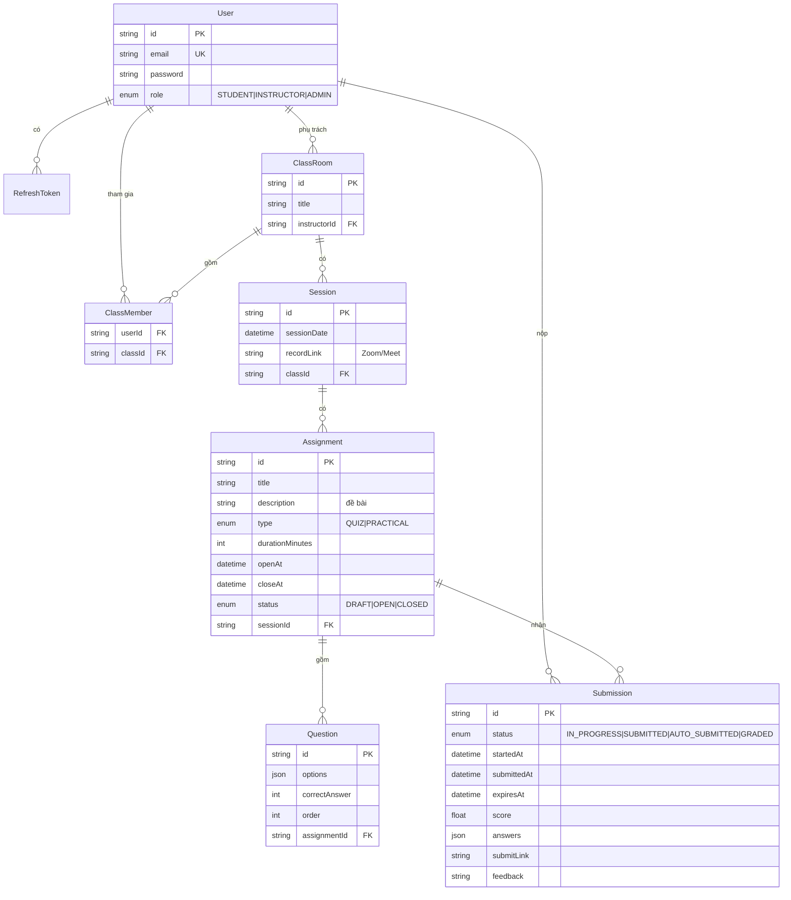
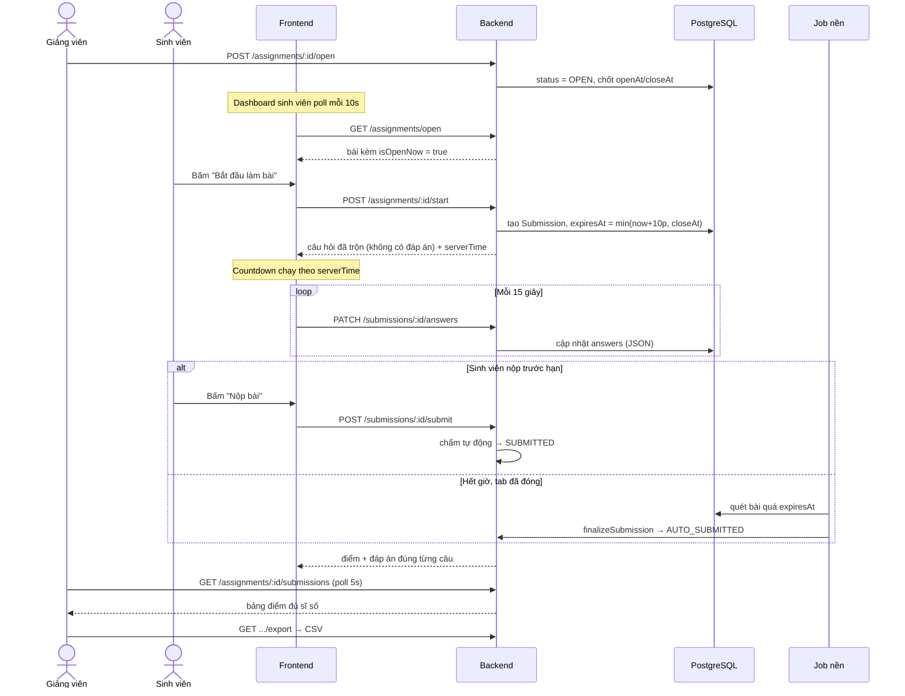
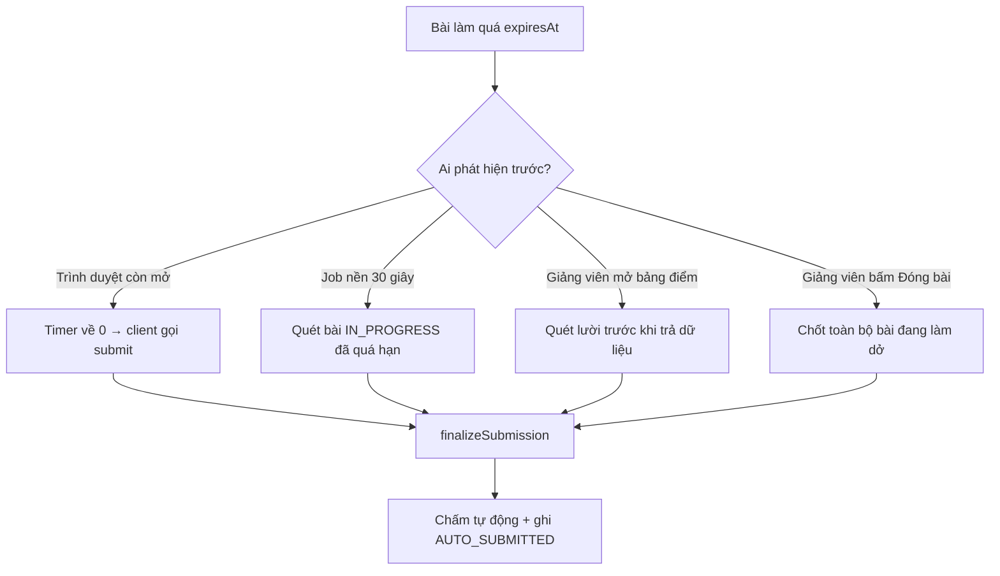
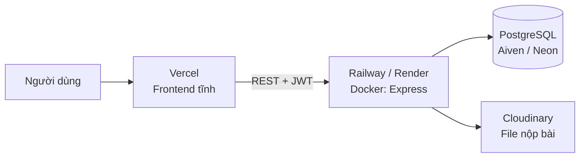

# Hệ thống lớp học trực tuyến — Luồng làm bài kiểm tra đầu giờ

**Báo cáo đồ án**

| | |
| --- | --- |
| Backend | `ELearning-backend-update` — Node.js, Express 5, TypeScript, Prisma 7, PostgreSQL |
| Frontend | `Elearning-web` — React 19, TypeScript, Vite 8, Tailwind CSS, TanStack Query |


---

## 1. Giới thiệu

### 1.1 Bài toán

Trong các lớp học phần thực hành, giảng viên thường có một bài kiểm tra ngắn đầu giờ (5–10 phút) để
đánh giá mức độ chuẩn bị bài. Làm thủ công thì phát đề, thu bài và chấm tay chiếm 15–20 phút của
buổi học, không có cách bắt cả lớp dừng bút đồng loạt, và sinh viên phải chờ nhiều ngày mới biết điểm.

Hệ thống này cho phép giảng viên mở một bài trắc nghiệm trong vài giây, sinh viên làm bài trên máy
hoặc điện thoại với đồng hồ đếm ngược, và nhận điểm ngay khi nộp. Ngoài ra hỗ trợ bài thực hành nộp
link hoặc file, giảng viên chấm tay kèm nhận xét.

### 1.2 Phạm vi

Trong phạm vi: quản lý lớp và buổi học, soạn đề trắc nghiệm có hẹn giờ và tự chấm, bài thực hành nộp
link hoặc file, bảng điểm và xuất CSV, phân quyền ba vai trò. Ngoài phạm vi: thanh toán, chấm tự
luận bằng AI, chống gian lận nâng cao (khoá tab, webcam), tích hợp LMS của trường.

### 1.3 Tác nhân và chức năng



---

## 2. Kiến trúc và dữ liệu

### 2.1 Kiến trúc tổng thể

Client–server ba tầng, frontend và backend tách rời, giao tiếp qua REST API.



Nghiệp vụ đặt hết ở tầng service, không phụ thuộc `req`/`res`. Nhờ vậy job nền dùng lại được đúng
hàm mà controller đang dùng — điểm này sẽ thấy rõ ở mục 3.5.

Ranh giới giữa bốn lớp: routes chỉ khai báo URL và gắn middleware; controllers validate dữ liệu vào
bằng Zod rồi gọi service; services giữ toàn bộ nghiệp vụ, phân quyền và tính toán điểm/thời gian,
không biết gì về HTTP; repositories chỉ chứa câu truy vấn Prisma.

### 2.2 Cơ sở dữ liệu




Ba điểm đáng chú ý, đều phục vụ trực tiếp cho luồng làm bài ở chương 3:

- **`Submission` có `@@unique([assignmentId, userId])`** — Mỗi sinh viên chỉ được nộp bài đúng 1 lần (DB tự chặn): Việc cài đặt thuộc tính unique cho bộ đôi (bài tập, sinh viên) ngay trong Cơ sở dữ liệu giúp tạo ra một "khóa bảo vệ" tuyệt đối. Dù sinh viên có cố tình mở 2 tab trình duyệt và bấm nộp bài cùng lúc, hệ thống cũng không bao giờ bị lỗi cho làm bài 2 lần để gian lận điểm.
- **`expiresAt` **. Thời gian hết giờ (expiresAt) được chốt cứng ngay từ lúc bấm "Bắt đầu làm bài": Hệ thống sẽ tính sẵn và ghi cố định mốc giờ sinh viên phải nộp bài.
- **`answers` là JSON `{ questionId: chỉ_số }`** thay vì bảng `Answer` chuẩn hoá. Tối ưu tốc độ lưu tự động (Auto-save):

Cách làm: Lưu toàn bộ đáp án của cả bài thi vào một ô dữ liệu duy nhất dạng JSON (ví dụ: Câu 1 chọn B, Câu 2 chọn A).

Lợi ích: Khi sinh viên đang làm bài, mỗi 15 giây hệ thống chỉ cần gửi 1 lệnh cập nhật đơn giản để ghi đè ô này. Nếu có 10 sinh viên cùng làm trong 10 phút, hệ thống chỉ mất 400 lượt ghi — nhẹ hơn rất nhiều so với cách lưu truyền thống (chia nhỏ từng câu ra từng dòng riêng).

---

## 3. Trọng tâm — Luồng làm bài thời gian thực

Đây là phần được đầu tư nhiều nhất. Một bài kiểm tra 10 phút nghe đơn giản, nhưng khi cả lớp cùng
làm thì có bốn yêu cầu kéo nhau về bốn hướng khác nhau:

| Yêu cầu | Vì sao khó |
| --- | --- |
| Đồng hồ phải công bằng | Client không đáng tin: chỉnh giờ máy, dừng JavaScript, đóng tab |
| Không được mất bài làm | Mạng chập chờn, F5 nhầm, hết pin giữa chừng |
| Hết giờ là phải dừng, kể cả khi tab đã đóng | Không có ai gọi API hộ sinh viên |
| Giảng viên thấy tiến độ ngay | Nhưng không được dựng cả hạ tầng realtime cho một lớp 10 người |

Cả bốn yêu cầu này được giải quyết bằng một nguyên tắc xuyên suốt: **server giữ sự thật, client chỉ
hiển thị**.

### 3.1 Sơ đồ luồng



### 3.2 Đồng hồ đếm ngược bấm giờ server

Nếu đồng hồ chỉ chạy ở trình duyệt, sinh viên chỉ cần chỉnh lại giờ hệ thống hoặc tạm dừng
JavaScript bằng DevTools là bài làm kéo dài vô hạn. Vì vậy thời điểm hết hạn được chốt **ở server
ngay khi bấm bắt đầu**, ghi vào `Submission.expiresAt`, và không bao giờ tính lại từ dữ liệu client:

```
expiresAt = min(startedAt + durationMinutes, closeAt)
```

Công thức lấy giá trị nhỏ hơn giữa hai mốc vì có hai ràng buộc độc lập: *thời lượng làm bài* của cá
nhân (bắt đầu muộn vẫn chỉ được 10 phút) và *thời điểm đóng bài* của cả lớp (8:10 là dừng, kể cả
người vừa bắt đầu lúc 8:09). Sinh viên vào muộn bị ràng buộc bởi mốc thứ hai — đúng với thực tế.

Frontend vẫn hiển thị đồng hồ, nhưng đó chỉ là **hiển thị**. Vấn đề còn lại: nếu máy sinh viên sai
giờ 5 phút thì con số đếm ngược cũng lệch 5 phút, gây hoang mang dù server vẫn chặn đúng.

Giải pháp là mỗi response kèm thêm `serverTime`. Hook `useCountdown` lấy độ lệch giữa giờ server và
giờ máy làm gốc, rồi đếm dựa trên độ lệch đó:

```ts
offsetRef.current = new Date(serverTime).getTime() - Date.now();
// mỗi giây:
const remaining = deadline - (Date.now() + offsetRef.current);
```

Nhờ vậy số đếm bám theo giờ server chứ không theo đồng hồ máy. Hook cũng dùng một cờ `firedRef` để
`onExpire` chỉ chạy đúng một lần, tránh gửi hai request nộp bài liên tiếp khi đồng hồ chạm 0.

Mọi thao tác ghi ở backend đều so `expiresAt` với giờ server trước khi thực hiện. Quá hạn thì request
bị từ chối và bài được chốt luôn với trạng thái `AUTO_SUBMITTED`.

> **Đã kiểm chứng.** Tạo bài đóng sau 5 giây, chờ quá hạn rồi gọi auto-save → server trả 400
> "Đã hết giờ làm bài", bài chuyển `AUTO_SUBMITTED` và được chấm tự động.

### 3.3 Auto-save 15 giây

Sinh viên chọn đáp án xong mà mất mạng hoặc lỡ đóng tab thì không được mất bài. Cứ 15 giây, frontend
gửi toàn bộ đáp án hiện tại lên server.

Ba chi tiết khiến cơ chế này chạy đúng mà không gây tác dụng phụ:

**Chỉ gửi khi có thay đổi.** Một cờ `dirtyRef` được bật khi sinh viên chọn đáp án và tắt ngay khi
bắt đầu gửi. Sinh viên đọc đề 3 phút không bấm gì thì không có request nào — nếu gửi vô điều kiện,
một buổi kiểm tra 10 phút của lớp 10 người sẽ tạo hàng trăm request thừa.

**Đọc đáp án qua ref, không qua closure.** Hàm chạy trong `setInterval` được tạo một lần; nếu nó đọc
biến state trực tiếp thì mãi mãi thấy giá trị của lần render đầu tiên và gửi lên bảng rỗng. Một
`answersRef` được đồng bộ lại sau mỗi lần render, và cả auto-save lẫn nút nộp bài đều đọc từ ref này.

**Trạng thái nháp tách khỏi trạng thái server.** Đáp án hiển thị được tính là
`draftAnswers ?? dữ liệu server trả về`. Khi sinh viên chưa sửa gì, `draftAnswers` là `null` và giao
diện dùng thẳng đáp án đã lưu — nên vào lại giữa chừng là thấy nguyên các lựa chọn cũ, không cần một
bước sao chép state nào.

Backend lọc lại đáp án nhận được, chỉ giữ những `questionId` thực sự thuộc bài tập đó, nên client
không thể chèn khoá lạ vào cột JSON.

Giao diện hiển thị rõ trạng thái ("Đã lưu lúc 08:03:15") để sinh viên yên tâm — một chi tiết nhỏ
nhưng quan trọng về mặt tâm lý khi đang bị bấm giờ.

### 3.4 Nộp bài và chấm ngay

Khi bấm nộp, frontend gửi kèm đáp án cuối cùng. Backend chấm ngay trong cùng request:

```
score = làm tròn 2 chữ số của (số câu đúng / tổng số câu × maxScore)
```

Sinh viên được chuyển thẳng sang màn hình kết quả, thấy điểm và chi tiết đúng/sai từng câu — tô xanh
đáp án đúng, tô đỏ lựa chọn sai của mình. Đây là khác biệt lớn nhất so với cách làm trên giấy: phản
hồi đến ngay lúc kiến thức còn nóng.

Hai chốt chặn ở luồng này:

- Một cờ `submittingRef` chặn nộp hai lần. Tình huống thực tế: sinh viên bấm "Nộp bài" đúng giây
  đồng hồ chạm 0, cả thao tác thủ công lẫn tự động cùng kích hoạt.
- `POST /assignments/:id/start` được thiết kế **idempotent** — gọi bao nhiêu lần cũng trả về đúng
  lượt đang có, không tạo lượt mới và không đặt lại đồng hồ. Nếu thiết kế ngược lại, sinh viên chỉ
  cần F5 là được thêm thời gian, đúng lỗ hổng mà mục 3.2 muốn chặn.

Đáp án đúng không bao giờ được gửi xuống client khi đang làm bài: `start` bóc bỏ `correctAnswer`
khỏi từng câu hỏi tại tầng service, và `correctAnswer` chỉ xuất hiện ở hai nơi — giảng viên soạn đề,
và màn hình kết quả **sau khi** bài đã nộp.

### 3.5 Tự nộp khi hết giờ

Sinh viên có thể tắt máy hoặc đóng tab trước khi hết giờ. Chỉ dựa vào trình duyệt gọi `submit` là
không đủ. Hệ thống dùng bốn đường phát hiện, tất cả cùng gọi một hàm `finalizeSubmission`:



Job nền là cơ chế chính nhưng có độ trễ tối đa 30 giây. Quét lười khi giảng viên mở bảng điểm bảo
đảm dữ liệu **nhìn thấy** luôn đúng tại thời điểm đọc, kể cả job chưa chạy tới. Vì cả bốn đường đều
gọi cùng một hàm và hàm đó chỉ đụng tới bài còn `IN_PROGRESS`, việc chạy chồng nhau không gây chấm
hai lần hay sai điểm.

Trạng thái phân biệt `SUBMITTED` (tự bấm nộp) với `AUTO_SUBMITTED` (hết giờ, hệ thống nộp thay). Về
điểm số hai trạng thái như nhau, nhưng giảng viên cần biết ai làm xong sớm và ai bị hết giờ — đó là
thông tin sư phạm, không phải thông tin kỹ thuật.

### 3.6 Bảng điểm gần thời gian thực

Trong lúc cả lớp đang làm bài, giảng viên cần thấy tiến độ. Đã cân nhắc hai phương án:

| | WebSocket / SSE | Polling định kỳ (đã chọn) |
| --- | --- | --- |
| Độ trễ | Tức thời | ≤ 5 giây |
| Hạ tầng | Server giữ kết nối, cấu hình proxy, xử lý reconnect | Không thêm gì |
| Mã nguồn | Thêm tầng sự kiện ở cả hai phía | Một dòng `refetchInterval` |
| Quy mô bài toán | Dư thừa | 10–50 sinh viên mỗi lớp |

Với một lớp vài chục người và một buổi kiểm tra 10 phút, độ trễ 5 giây không đáng kể so với chi phí
vận hành của kết nối thời gian thực. Giao diện có nút tắt/bật để giảng viên chủ động. Tương tự, danh
sách "bài đang mở" của sinh viên làm mới mỗi 10 giây để bắt được khoảnh khắc giảng viên bấm "Mở bài".

Bảng điểm không trả danh sách bài nộp thuần tuý mà **ghép danh sách thành viên lớp với danh sách bài
nộp**, để sinh viên chưa bắt đầu vẫn xuất hiện với trạng thái rỗng. Lý do: trong lúc lớp đang làm
bài, câu hỏi thực sự của giảng viên là *"còn ai chưa làm?"* chứ không phải *"đã có bao nhiêu bài
nộp?"*. Việc ghép làm ở backend nên cả giao diện lẫn file CSV xuất ra đều nhất quán.

### 3.7 Hệ quả và đánh đổi

Chọn polling kéo theo một hệ quả không lường trước lúc thiết kế: **quota rate limit mặc định 100
request/15 phút là không đủ**. Một sinh viên làm bài 10 phút tốn khoảng 40 lượt auto-save; giảng viên
mở bảng điểm 10 phút tốn 120 lượt. Đã nâng lên 1.000 và cho cấu hình qua biến môi trường.

Một hệ quả khác phát hiện khi thử với nhiều tài khoản: quota đăng nhập 10 request/15 phút chặn đứng
cả lớp, vì 10 sinh viên trong phòng máy dùng chung một IP của trường. Đã nâng lên 50.

| Đánh đổi | Được | Mất |
| --- | --- | --- |
| Polling thay realtime | Không thêm hạ tầng, mã đơn giản | Trễ tối đa 5 giây |
| `answers` dạng JSON | Auto-save chỉ một lệnh UPDATE | Khó thống kê theo từng phương án |
| Auto-save theo chu kỳ | Ít request, dễ suy luận | Mất tối đa 15 giây thao tác cuối nếu sập máy |
| Job nền 30 giây | Không cần hạ tầng hàng đợi | Bài hết giờ có thể chốt trễ tới 30 giây |

---

## 4. Cài đặt và kiểm thử

### 4.1 Công nghệ

TypeScript cho cả hai đầu để dùng chung kiểu dữ liệu và bắt lỗi lúc biên dịch. Backend là Express 5 +
Prisma 7 trên PostgreSQL — chọn PostgreSQL vì cần kiểu JSON cho cột `answers` và ràng buộc unique
nhiều cột; Zod 4 vừa validate vừa suy ra kiểu. Frontend là React 19 + Vite 8 + Tailwind, dùng
TanStack Query cho cache và polling (`refetchInterval` có sẵn, xem mục 3.6) và Zustand cho phiên đăng
nhập. File nộp bài lưu trên Cloudinary.

### 4.2 Kiểm thử tự động

Kiểm thử chạy trên cơ sở dữ liệu thật, tập trung vào luồng ở chương 3.

**`npm run smoke` — 13 bước qua HTTP.** Seed lại dữ liệu rồi chạy trọn kịch bản: đăng nhập ba vai
trò → mở bài → bắt đầu làm (kiểm tra response **không** chứa `correctAnswer`) → auto-save → nộp đúng
4/5 câu được **8/10 điểm** → gọi lại `start` bị chặn **409** → giảng viên đóng bài khi một sinh viên
đang làm dở, sinh viên đó chuyển **`AUTO_SUBMITTED`** và có điểm → bảng điểm **10 dòng đủ sĩ số**,
CSV 11 dòng → sinh viên gọi API bảng điểm nhận **403** → nộp bài thực hành và chấm 9 điểm.


Các tình huống biên đã kiểm:

| Tình huống | Kết quả |
| --- | --- |
| Hết giờ khi tab đã đóng | 400 "Đã hết giờ", bài `AUTO_SUBMITTED` và được chấm |
| Tải lại trang giữa chừng | Cùng lượt, cùng thứ tự câu hỏi, đồng hồ không reset |
| Hai sinh viên nhìn bài nhau | Thứ tự câu hỏi khác nhau: `3-4-2-1-5` và `5-4-2-1-3` |
| Nộp lại để lấy điểm cao hơn | Chặn `409` |
| Lộ đáp án | Response của `start` không có khoá `correctAnswer` |
| Giao diện trên điện thoại | Đồng hồ và nút nộp bài vừa màn hình 390×844 |

### 4.3 Lỗi phát hiện nhờ kiểm thử end-to-end

| Lỗi | Nguyên nhân | Cách sửa |
| --- | --- | --- |
| Biến môi trường không được nạp | `dotenv.config()` chạy **sau** các câu lệnh import, mà Prisma và JWT đọc biến ngay lúc module được nạp | Chuyển thành `import "dotenv/config"` ở dòng đầu |
| Trình duyệt bị CORS chặn hoàn toàn | `CLIENT_URL` rỗng; toán tử `??` chỉ thay thế `null`/`undefined` | Đổi sang `\|\|`, và chấp nhận mọi cổng localhost khi chạy dev |
| Cả lớp bị chặn đăng nhập | Rate limit 10 request/15 phút cho một IP dùng chung | Nâng lên 50, cho cấu hình qua biến môi trường |

Hai lỗi sau chỉ lộ ra khi chạy thật với trình duyệt và nhiều tài khoản — minh hoạ giá trị của kiểm
thử end-to-end thay vì chỉ kiểm thử từng hàm. Ngoài ra còn hai lỗi cấu hình khác: `pg` v8.20 hiểu
`sslmode=require` thành `verify-full` nên không kết nối được PostgreSQL (thêm `uselibpqcompat=true`),
và frontend đọc sai lớp bao bì của response refresh token.

---

## 5. Triển khai



Backend dùng Dockerfile hai tầng: tầng builder sinh Prisma Client rồi biên dịch TypeScript, tầng
chạy chỉ giữ `dist` và gói production. Container khởi động sẽ chạy `prisma migrate deploy` trước khi
mở cổng, nên cơ sở dữ liệu luôn khớp schema.


---

## 6. Kết quả và hướng phát triển

### 6.1 Đã hoàn thành

Toàn bộ chức năng cho ba vai trò, kịch bản kiểm tra đầu giờ chạy thông suốt và đã kiểm chứng tự động
ở cả tầng API lẫn giao diện. Cơ chế chống gian lận thời gian gồm hạn nộp do server chốt, tự nộp bốn
lớp, chặn làm lại, và trộn câu hỏi riêng cho từng sinh viên. Giao diện dùng được trên điện thoại.

### 6.2 Hạn chế

| Hạn chế | Ảnh hưởng | Hướng khắc phục |
| --- | --- | --- |
| Bảng điểm trễ tối đa 5 giây | Không đáng kể ở quy mô lớp học | Chuyển sang WebSocket nếu mở rộng |
| Auto-save theo chu kỳ 15 giây | Mất tối đa 15 giây thao tác cuối nếu máy sập | Lưu tạm vào localStorage song song |
| Chưa có unit test cho từng hàm | Kiểm thử dựa vào end-to-end | Bổ sung Vitest cho `resolveExpiresAt`, `gradeQuiz` |

Ngoài ra hệ thống mới chỉ hỗ trợ câu hỏi một đáp án đúng, và không chống được việc sinh viên tra cứu
tài liệu ngoài — phần này vẫn cần giảng viên giám sát trực tiếp tại lớp.

### 6.3 Hướng phát triển

1. Ngân hàng câu hỏi dùng lại giữa các buổi, sinh đề ngẫu nhiên N câu.
2. Thống kê độ khó từng câu (tỉ lệ trả lời đúng) để giảng viên điều chỉnh đề.
3. Nhiều loại câu hỏi: chọn nhiều đáp án, điền khuyết, nối cặp.
4. Thông báo đẩy khi giảng viên mở bài, thay cho việc poll định kỳ.

---

## 7. Phụ lục

### 7.1 Tài khoản demo

Chạy `npm run seed`. Mật khẩu chung `123456`.

| Tài khoản | Vai trò |
| --- | --- |
| `admin@elearning.local` | Quản trị |
| `gv.web@elearning.local` | Giảng viên, phụ trách lớp "Lập trình Web" |
| `sv01@elearning.local` … `sv10@elearning.local` | Sinh viên trong lớp |

### 7.2 Kịch bản demo

| Thời điểm | Thao tác |
| --- | --- |
| 08:00 | Giảng viên vào lớp "Lập trình Web" → Buổi 3 → bài quiz 5 câu, 10 phút → bấm **Mở bài** |
| 08:01 | Sinh viên thấy bài đang mở → **Làm bài** → đồng hồ đếm ngược 10:00 → chọn đáp án, auto-save |
| 08:08 | Một sinh viên nộp sớm → chấm ngay 4/5 câu = 8.0 điểm, xem được đáp án đúng từng câu |
| 08:10 | Hết giờ → sinh viên chưa nộp được tự nộp và chấm tự động |
| 08:11 | Bảng điểm đủ 10 dòng → xuất CSV → gắn link record vào buổi học |
| 08:15 | Giao bài thực hành hạn 23:59 → sinh viên nộp link GitHub → giảng viên chấm 9 điểm kèm nhận xét |

### 7.3 Lệnh thường dùng

```bash
# Backend
npm run dev              # chạy phát triển
npm run seed             # tạo lại dữ liệu demo
npm run smoke            # kiểm thử API 13 bước

# Frontend
npm run dev              # chạy phát triển (cổng 5173)

```

### 7.4 Tài liệu kèm theo

- [`DEPLOY.md`](DEPLOY.md) — hướng dẫn deploy từng bước
- [`API.md`](API.md) — mô tả đầy đủ 52 endpoint
- [`prisma/schema.prisma`](prisma/schema.prisma) — định nghĩa cơ sở dữ liệu
- `Elearning-web/README.md` — hướng dẫn chạy frontend
